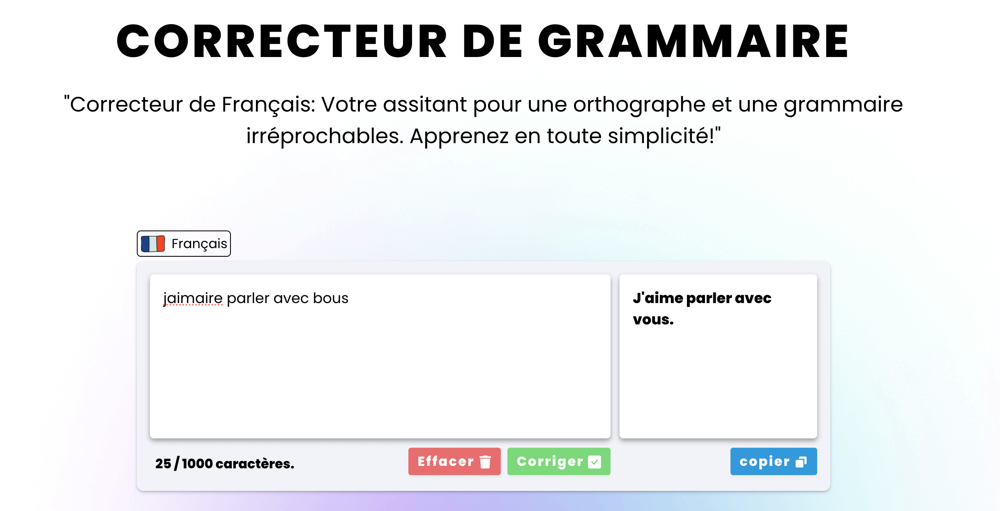

# CORRECTEUR DE GRAMMAIRE

 
## Front-end
  

## Back-end

 

## Description
Application qui corrige les fautes d'orthographe en français, en utilisant React js pour le Front end  et l'API d'openai avec Laravel pour le backend.

---

## Configuration du projet en LOCAL

### Back-end

#### 1. Faire un clone du projet.

 `git clone project_url` 

#### 2.Changez de répertoire vers le projet.

Une fois cloné, changez le répertoire vers le projet en exécutant la commande suivante :

> **cd** project_name / corrector-back-end

### 3. Installing dependencies

Install the project dependencies using Composer.

> **composer** install

### 4. Copier le fichier .env.example

Create a new .env file from :
 .env.example 
> **cp** .env.example .env 

### 5. Generating the application key

Generate a new application key for the Laravel project

> php artisan key:generate

---
Vous avez besoin d'un Token d'api de chat gpt pour faire fonctionner le projet.

[guide pour avoir le token](https://platform.openai.com/docs/guides/gpt)

Avant de pouvoir exécuter le projet localement, veuillez suivre ces étapes de configuration :

1. Ajustez le fichier `.env` : Assurez-vous de configurer correctement le fichier `.env` de votre projet Laravel Vous devez ajouter la variable `OPENAI_API_KEY = votre token` 

2. Lancer le serveur Laravel : Ouvrez votre terminal ou votre invite de commande, accédez au répertoire racine de votre projet Laravel et exécutez la commande `php artisan serve` pour démarrer le serveur Laravel en local. Cela permettra à votre application Laravel d'être accessible à l'adresse `http://localhost:8000` (ou une autre URL spécifiée par le serveur).

### Front-End

### 1. Installing dependencies 
Aller sur le dossier corrector-front-end

> **npm** install

### 2. Démarrer le serveur 

> **npm** run dev

 Cela permettra à votre application React d'être accessible à l'adresse `http://localhost:5173` (ou une autre URL spécifiée par le serveur de développement).

## Utilisation

dans le composant corrector changer le nom de variable `const URL_API` pour l'url de votre partie laravel.

Une fois que vous avez configuré et démarré les serveurs, vous pouvez accéder à votre application en ouvrant votre navigateur et en visitant les URL suivantes :

- Pour la partie Laravel : [http://localhost:8000](http://localhost:8000)
- Pour la partie React : [http://localhost:5173](http://localhost:5173)

Assurez-vous que les deux serveurs sont en cours d'exécution simultanément pour que votre application fonctionne correctement.
